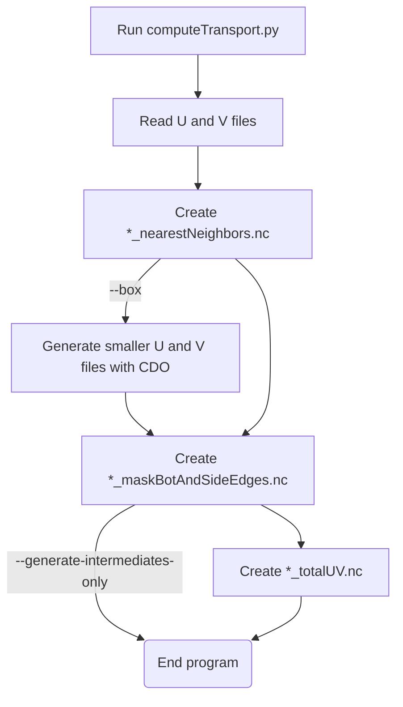

# Computing transports with `computeTransport.py`
This code uses CF-compliant, iHESP CESM1.3 HighRes U and V NetCDF files, to compute a transect's total transport.

## Prerequisites
* linux
* python
* conda

After prerequisites are met, run:
```
conda env update --name itf --file environment.yml --prune
```
This will allow additional python packages and CDO to be installed by `conda`. 

## How to run
### 1. Activate the conda environment
Navigate to this repo's root, then run:
```
conda activate itf
```
### 2. Run the `computeTransport.py` script in the conda environment:
```
(itf) $ python3 computeTransport.py
    --ufile 'B.E.13.BRCP85C5CN.ne120_t12.sehires38.003.sunway.CN_OFF.pop.h.UVEL.201501-201512.nc' \
    --vfile 'B.E.13.BRCP85C5CN.ne120_t12.sehires38.003.sunway.CN_OFF.pop.h.VVEL.201501-201512.nc' \
    ./Transect01.txt
```

### 3. Navigate to `./output/transects/` to see the output:
You can try running `ncdump` (if available) to see the contents of the file
```
$ ncdump output/transects/IX1/IX1_totalUV_2015.nc
netcdf IX1_totalUV_2015.nc {
dimensions:
        time = 12 ;
variables:
        double time(time) ;
                time:_FillValue = NaN ;
                time:units = "days since 0001-01-01;" ;
                time:calendar = "365_day" ;
        double tPt(time) ;
                tPt:_FillValue = NaN ;

// global attributes:
                :title = "Total transport (Sv) computed using the IX1 transect" ;
                :time = "taken from time_bnd variable" ;
data:

 time = 735110, 735141, 735169, 735200, 735230, 735261, 735291, 735322,
    735353, 735383, 735414, 735444 ;

 tPt = -6.96280127004239, -7.85129417018123, -6.98129136003175,
    -14.999389408029, -14.000998301705, -23.0351287206712, -18.4427470499132,
    -22.9315890106232, -18.0165440057381, -16.8907236473478,
    -9.73942300136616, -9.97510873087705 ;
}
```

## Runtime options
```
$ python3 computeTransport.py -h
usage: computeTransport.py [-h] [-d] [-g] [-f] [-b] [-u UFILE_FILE] [-v VFILE_FILE] [-t TAG] TRANSECT_FILE

Compute transport on transect line using iHESP CESM1.3 HighRes NetCDF input using python and CDO (Climate Data Operators)

positional arguments:
  TRANSECT_FILE         File that contains input parameters for this transect. TRANSECT_FILE is also used for intermidiate and
                        output file prefixes, e.g. TRANSECT_FILE_totalUV.nc

options:
  -h, --help            show this help message and exit
  -d, --debug           Enable DEBUG outputs
  -g, --generate-intermediates-only
                        Only generate the intermidiate files, *_nearestNeighbors.nc and *_maskBotAndSideEdges.nc, then exit
  -f, --force           Always regenerate all files (default: skip recomputing existing files)
  -b, --box             Generate smaller input files from UFILE_FILE and VFILE_FILE using "cdo selindexbox"
  -u UFILE_FILE, --ufile UFILE_FILE
                        CF compliant iHESP CESM1.3 HighRes file that contains U velocities
  -v VFILE_FILE, --vfile VFILE_FILE
                        CF compliant iHESP CESM1.3 HighRes file that contains V velocities
  -t TAG, --tag TAG     String to append at the end the output file, i.e.: *_totalUV_TAG.nc
```

## Flowchart


## What the input `TRANSECT_FILE` should contain
| Option  | Meaning | 
|:--------|:---------|
|  lats | comma delimiated latitute values in degrees |
|  lons | comma delimiated longitude values in degrees |
|  xyResolution | value used to create in-between points on your transect line with this precision |
|  outputDir | directory to store intermidiate and output files |
|  boxDir | __(used when `--box` is set)__ directory to store the smaller U and V files generated by CDO |
|  north | __(used when `--box` is set)__ northern boundary of smaller U V file to be generated |
|  south | __(used when `--box` is set)__ southern boundary of smaller U V file to be generated |
|  east  | __(used when `--box` is set)__ eastern boundary of smaller U V file to be generated |
|  west  | __(used when `--box` is set)__ western boundary of smaller U V file to be generated |


See [Transect01.txt](./Transect01.txt) as an example:
```
lats=-6.79,-19.55,-31.32
lons=105.17,108.79,114.84
xyResolution=0.05
outputDir=./output/transects/Transect01/
boxDir=./input/roughcut/
north=9.505
south=-37.505
east=139.505
west=95.505
```

## Conventions and limitations

### Transport Sign Conventions
The total transport magnitude is defined by this table:
| Transect Orientation  |  Direction | 
|:----------------------|:-----------|
|  horizontal | `+` towards north |
|  vertical | `+` towards east |
|  postively sloping | `+` towards north-east |
|  negatively sloping | `+` towards south-east |


### Creating transect lines
This code cannot work with transect lines that change between positively and negatively sloping segments.

For example:

```
NOT OK:                         OK:
┌────────────────────────┐ ┌────────────────────────┐
│ x        xx            │ │  x                     │
│  x      x  x           │ │  x                     │
│   x   xx    x          │ │  x                     │
│    x x      x          │ │  x                     │
│     x        x         │ │  x                     │
│               xx       │ │  x                     │
│                 x      │ │  xx                    │
│                  xx    │ │    xx                  │
│                    x   │ │      xx                │
│                     x  │ │        xxxxxxxx        │
│                      x │ │                xxxxxxx │
└────────────────────────┘ └────────────────────────┘
```

### Assumptions about input U and V files
* This code is tuned to only use iHESP CESM1.3 HighRes NetCDF files with a nominal resolution of 0.1deg for the ocean
* `-1` values are hardcoded to mean land on the file's REGION_MASK variable and therefore removed in all transport/LatLon operations

## Gotchas

### Memory issues
When you receive and error like"
```
[..]
MemoryError: Unable to allocate 10 GB for an array with shape 
[..]
```
Try using `--box` to leverage CDO's ability to efficiently create smaller U and V files:

```
$ python3 computeTransport.py
    --debug \
    --ufile './input/raw/uvel/B.E.13.BRCP85C5CN.ne120_t12.sehires38.003.sunway.CN_OFF.pop.h.UVEL.201501-201512.nc' \
    --vfile './input/raw/uvel/B.E.13.BRCP85C5CN.ne120_t12.sehires38.003.sunway.CN_OFF.pop.h.VVEL.201501-201512.nc' \
    --box \
    --tag 2015-smallbox \
    ./input/transects/Transect01/Transect01.txt

2022-05-02 23:28:42.724837 1683328 [INFO] Starting
2022-05-02 23:28:42.724889 1683328 [DEBUG] Debug mode detected
2022-05-02 23:28:42.724899 1683328 [INFO] ufile: ./input/raw/uvel/B.E.13.BRCP85C5CN.ne120_t12.sehires38.003.sunway.CN_OFF.pop.h.UVEL.201501-201512.nc
2022-05-02 23:28:42.724922 1683328 [INFO] vfile: ./input/raw/uvel/B.E.13.BRCP85C5CN.ne120_t12.sehires38.003.sunway.CN_OFF.pop.h.UVEL.201501-201512.nc
2022-05-02 23:28:42.724930 1683328 [INFO] tag: "2015-smallbox" detected, will create "*_totalUV_2015-smallbox.nc" output if able
2022-05-02 23:28:42.731879 1683328 [INFO] Creating 0.05-spaced points with endpoints -6.790 to -31.320 latitude and 105.170 to 114.840 longitude
2022-05-02 23:28:44.131626 1683328 [DEBUG] --box detected
2022-05-02 23:28:44.131705 1683328 [DEBUG] Original bounds of run was [105.170000, 114.840000, -31.320000, -6.790000]
2022-05-02 23:28:44.131717 1683328 [DEBUG] Original bounds of run with offsets is [104.670000, 115.340000, -31.820000, -6.290000]
2022-05-02 23:28:44.132000 1683328 [DEBUG] ./input/roughcut//105.170_114.840_-31.320_-6.790/B.E.13.BRCP85C5CN.ne120_t12.sehires38.003.sunway.CN_OFF.pop.h.UVEL.201501-201512.105.170_114.840_-31.320_-6.790.nc does not exist yet
2022-05-02 23:28:44.132073 1683328 [INFO] Extracting data from ./input/raw/uvel/B.E.13.BRCP85C5CN.ne120_t12.sehires38.003.sunway.CN_OFF.pop.h.UVEL.201501-201512.nc
2022-05-02 23:28:44.132085 1683328 [DEBUG] Setting bounds to bwest = 104.670, beast = 115.340, bsouth = -31.820, bnorth = -6.290,
2022-05-02 23:28:47.483403 1683328 [DEBUG] Setting bounds to ixd1 = 2147, ixd2 = 2252, iyd1 = 846, iyd2 = 1118,
2022-05-02 23:28:47.602246 1683328 [INFO] Running: cdo -selindexbox,2147,2252,846,1118 -selname,UVEL,TLONG,TLAT,ULONG,ULAT,HTE,HTN,dz,REGION_MASK ./input/raw/uvel/B.E.13.BRCP85C5CN.ne120_t12.sehires38.003.sunway.CN_OFF.pop.h.UVEL.201501-201512.nc ./input/roughcut//105.170_114.840_-31.320_-6.790/B.E.13.BRCP85C5CN.ne120_t12.sehires38.003.sunway.CN_OFF.pop.h.UVEL.201501-201512.105.170_114.840_-31.320_-6.790.nc
2022-05-02 23:37:16.162440 1683328 [INFO] Generating md5sum for ./input/roughcut//105.170_114.840_-31.320_-6.790/B.E.13.BRCP85C5CN..ne120_t12.sehires38.003.sunway.CN_OFF.pop.h.UVEL.201501-201512.105.170_114.840_-31.320_-6.790.nc
2022-05-02 23:37:16.547724 1683328 [INFO] Data extracted.
2022-05-02 23:37:16.569255 1683328 [DEBUG] Minimum longitude: 104.700000; Maximum longitude: 115.200000; Minimum latitude: -31.831719, Maximum latitude: -6.387040
2022-05-02 23:37:16.582767 1683328 [DEBUG] Checking if UVEL,TLONG,TLAT,ULONG,ULAT,HTE,HTN,dz,REGION_MASK in input dataset
2022-05-02 23:37:16.582973 1683328 [INFO] UVEL,TLONG,TLAT,ULONG,ULAT,HTE,HTN,dz,REGION_MASK is detected in uBox
2022-05-02 23:37:16.583187 1683328 [INFO] Extracting data from ./input/raw/uvel/B.E.13.BRCP85C5CN.ne120_t12.sehires38.003.sunway.CN_OFF.pop.h.VVEL.201501-201512.nc
2022-05-02 23:37:16.583201 1683328 [DEBUG] Setting bounds to bwest = 104.670, beast = 115.340, bsouth = -31.820, bnorth = -6.290,
2022-05-02 23:37:20.141491 1683328 [DEBUG] Setting bounds to ixd1 = 2147, ixd2 = 2252, iyd1 = 846, iyd2 = 1118,
2022-05-02 23:37:20.142022 1683328 [INFO] Running: cdo -selindexbox,2147,2252,846,1118 -selname,VVEL,TLONG,TLAT,ULONG,ULAT,HTE,HTN,dz,REGION_MASK ./input/raw/uvel/B.E.13.BRCP85C5CN.ne120_t12.sehires38.003.sunway.CN_OFF.pop.h.VVEL.201501-201512.nc ./input/roughcut//105.170_114.840_-31.320_-6.790/B.E.13.BRCP85C5CN.ne120_t12.sehires38.003.sunway.CN_OFF.pop.h.VVEL.201501-201512.105.170_114.840_-31.320_-6.790.nc
2022-05-02 23:45:41.756470 1683328 [INFO] Generating md5sum for ./input/roughcut//105.170_114.840_-31.320_-6.790/B.E.13.BRCP85C5CN.ne120_t12.sehires38.003.sunway.CN_OFF.pop.h.VVEL.201501-201512.105.170_114.840_-31.320_-6.790.nc
2022-05-02 23:45:42.033245 1683328 [INFO] Data extracted.
2022-05-02 23:45:42.054323 1683328 [DEBUG] Minimum longitude: 104.700000; Maximum longitude: 115.200000; Minimum latitude: -31.831719, Maximum latitude: -6.387040
2022-05-02 23:45:42.069218 1683328 [DEBUG] Checking if VVEL,TLONG,TLAT,ULONG,ULAT,HTE,HTN,dz,REGION_MASK in input dataset
2022-05-02 23:45:42.069454 1683328 [INFO] VVEL,TLONG,TLAT,ULONG,ULAT,HTE,HTN,dz,REGION_MASK is detected in vBox
2022-05-02 23:45:42.071137 1683328 [INFO] ./output/transects/Transect01//Transect01_nearestNeighbors.nc does not exist, and/or "nearestNeighborsMD5" is not set on ./input/transects/Transect01/Transect01.txt
2022-05-02 23:45:42.071171 1683328 [INFO] Performing nearest neighbor for 493 points
2022-05-02 23:45:43.469522 1683328 [DEBUG] Done with nearest neighbor calculation.
2022-05-02 23:45:43.470367 1683328 [INFO] Creating ./output/transects/Transect01//Transect01_nearestNeighbors.nc
2022-05-02 23:45:43.566588 1683328 [INFO] Generating md5sum for ./output/transects/Transect01//Transect01_nearestNeighbors.nc
2022-05-02 23:45:43.567431 1683328 [INFO] ./output/transects/Transect01//Transect01_maskBotAndSideEdges.nc does not exist, and/or "maskBotAndSideEdgesMD5" is not set on ./input/transects/Transect01/Transect01.txt
2022-05-02 23:45:43.567549 1683328 [INFO] Creating mask for 493 points
2022-05-02 23:45:46.453691 1683328 [DEBUG] Done creating mask.
2022-05-02 23:45:46.456730 1683328 [INFO] Creating ./output/transects/Transect01//Transect01_maskBotAndSideEdges.nc
2022-05-02 23:45:46.608805 1683328 [INFO] Generating md5sum for ./output/transects/Transect01//Transect01_maskBotAndSideEdges.nc
2022-05-02 23:45:46.614473 1683328 [INFO] Sorting indices to figure out velocity sides.
2022-05-02 23:45:46.645735 1683328 [INFO] Processing run tagged: 2015-smallbox
2022-05-02 23:45:46.645776 1683328 [INFO] Computing transport using u and v.
2022-05-02 23:45:46.645784 1683328 [DEBUG] Creating velsSide
2022-05-02 23:45:47.251939 1683328 [DEBUG] Creating velsBott
2022-05-02 23:45:47.375116 1683328 [DEBUG] Removing unused z data and removing unused land data
2022-05-02 23:45:47.376208 1683328 [DEBUG] Multiplying SideZX=dz*dy
2022-05-02 23:45:47.376895 1683328 [DEBUG] Multiplying BottZX=dz*dx
2022-05-02 23:45:47.377059 1683328 [DEBUG] Removing nans from SideZX and BottZX
2022-05-02 23:45:47.377131 1683328 [DEBUG] Summing SideZX and BottZX
2022-05-02 23:45:47.379849 1683328 [INFO] Computed transport: [  5.97486417 -15.70044091  -2.7315463   -8.65086378  -7.02808906   8.78652236   1.22435789  -2.55819389   7.80532729 -12.30828503  -1.26679543   1.42979442]
2022-05-02 23:45:47.379904 1683328 [INFO] Creating ./output/transects/Transect01//Transect01_totalUV_2015-smallbox.nc
2022-05-02 23:45:47.487194 1683328 [INFO] Generating md5sum for ./output/transects/Transect01//Transect01_totalUV_2015-smallbox.nc
2022-05-02 23:45:47.490250 1683328 [INFO] Done.
```

