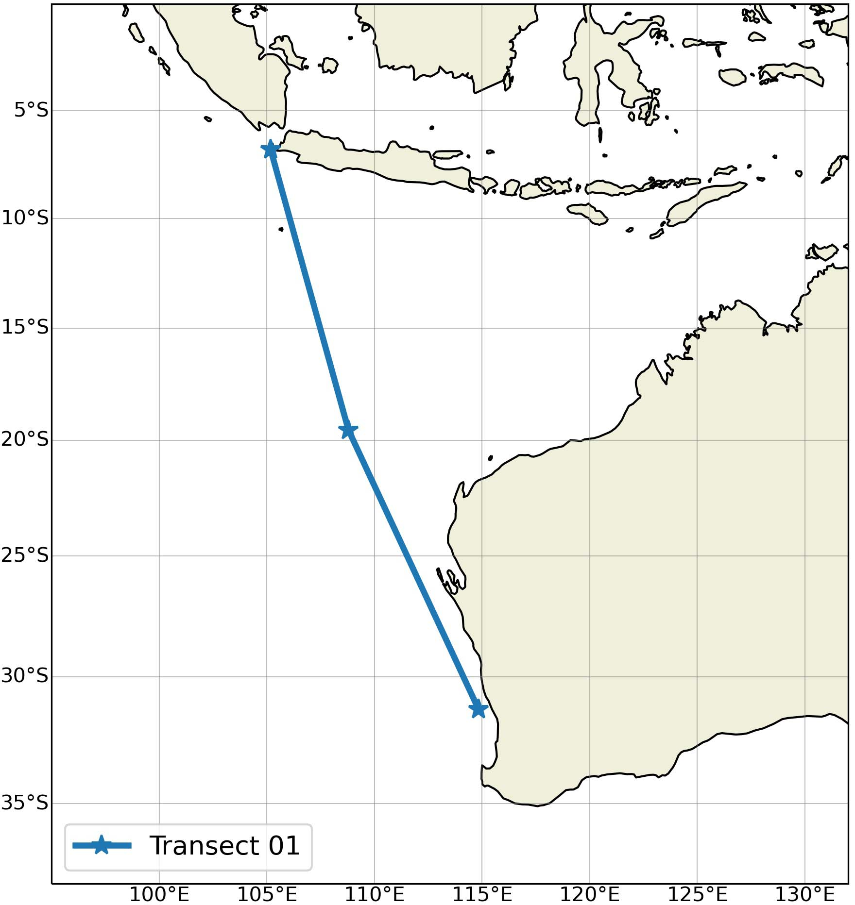

# Calculating total transport across a transect with `computeTransport.py`
This code uses CF-compliant, [iHESP CESM1.3 HighRes u- and v-velocity NetCDF files](https://ihesp.github.io/archive/products/ihesp-products/data-release/DataRelease_Phase2.html) to compute a transect's total transport.

## Prerequisites
This code runs on a CLI (command line interface).
### Required software
* `python3`
* `conda`

After prerequisites are met, run:
```
conda env update --name itf --file environment.yml --prune
```
This will allow additional python packages and CDO (Climate Data Operators) to be installed by `conda`. 

## Sample run
We will be computing the transport across a transect defined by [`./sample/Transect01.txt`](./sample/Transect01.txt).



This example run uses a sub-sample of the 2015 u- and v-velocity files from iHESP CESM1.3 HighRes.
```
./sample/input/B.E.13.BRCP85C5CN.ne120_t12.sehires38.003.sunway.CN_OFF.pop.h.UVEL.201501-201512.105.170_114.840_-31.320_-6.790.nc
./sample/input/B.E.13.BRCP85C5CN.ne120_t12.sehires38.003.sunway.CN_OFF.pop.h.VVEL.201501-201512.105.170_114.840_-31.320_-6.790.nc
```
> __Note:__ Alternatively, this code can utilize the original [u-velocity](https://datahub.geos.tamu.edu:8880/thredds/catalog/iHESPDataHUB/B.E.13.BRCP85C5CN.ne120_t12.sehires38.003.sunway.CN_OFF/ocn/UVEL/catalog.html?dataset=iHESPDataHUB/B.E.13.BRCP85C5CN.ne120_t12.sehires38.003.sunway.CN_OFF/ocn/UVEL/B.E.13.BRCP85C5CN.ne120_t12.sehires38.003.sunway.CN_OFF.pop.h.UVEL.201501-201512.nc) and [v-velocity](https://datahub.geos.tamu.edu:8880/thredds/catalog/iHESPDataHUB/B.E.13.BRCP85C5CN.ne120_t12.sehires38.003.sunway.CN_OFF/ocn/VVEL/catalog.html?dataset=iHESPDataHUB/B.E.13.BRCP85C5CN.ne120_t12.sehires38.003.sunway.CN_OFF/ocn/VVEL/B.E.13.BRCP85C5CN.ne120_t12.sehires38.003.sunway.CN_OFF.pop.h.VVEL.201501-201512.nc) files found on the iHESP CESM1.3 HighRes website. These provided subsamples are small enough to ensure a workable Git repository.

### 1. Activate the conda environment
Navigate to this repo's root, then run:
```
conda activate itf
```
### 2. Run the `computeTransport.py` script in the conda environment:
```
(itf) $ python3 computeTransport.py \
    --ufile './sample/input/B.E.13.BRCP85C5CN.ne120_t12.sehires38.003.sunway.CN_OFF.pop.h.UVEL.201501-201512.105.170_114.840_-31.320_-6.790.nc' \
    --vfile './sample/input/B.E.13.BRCP85C5CN.ne120_t12.sehires38.003.sunway.CN_OFF.pop.h.VVEL.201501-201512.105.170_114.840_-31.320_-6.790.nc' \
    ./sample/Transect01.txt
```
Something like this should pop up during the run:
```
2022-05-03 01:12:54.730163 1683874 [INFO] Starting
2022-05-03 01:12:54.730208 1683874 [INFO] ufile: sample/input/B.E.13.BRCP85C5CN.ne120_t12.sehires38.003.sunway.CN_OFF.pop.h.UVEL.201501-201512.105.170_114.840_-31.320_-6.790.nc
2022-05-03 01:12:54.730217 1683874 [INFO] vfile: sample/input/B.E.13.BRCP85C5CN.ne120_t12.sehires38.003.sunway.CN_OFF.pop.h.UVEL.201501-201512.105.170_114.840_-31.320_-6.790.nc
2022-05-03 01:12:54.732921 1683874 [INFO] Creating 0.05-spaced points with endpoints -6.790 to -31.320 latitude and 105.170 to 114.840 longitude
2022-05-03 01:12:54.906681 1683874 [INFO] ./sample/output//Transect01_nearestNeighbors.nc does not exist, and/or "nearestNeighborsMD5" is not set on ./sample/Transect01.txt
2022-05-03 01:12:54.906715 1683874 [INFO] Performing nearest neighbor for 493 points
2022-05-03 01:12:56.358592 1683874 [INFO] Creating ./sample/output//Transect01_nearestNeighbors.nc
2022-05-03 01:12:56.383978 1683874 [INFO] Generating md5sum for ./sample/output//Transect01_nearestNeighbors.nc
2022-05-03 01:12:56.385943 1683874 [INFO] ./sample/output//Transect01_maskBotAndSideEdges.nc does not exist, and/or "maskBotAndSideEdgesMD5" is not set on ./sample/Transect01.txt
2022-05-03 01:12:56.386029 1683874 [INFO] Creating mask for 493 points
2022-05-03 01:12:59.325506 1683874 [INFO] Creating ./sample/output//Transect01_maskBotAndSideEdges.nc
2022-05-03 01:12:59.529989 1683874 [INFO] Generating md5sum for ./sample/output//Transect01_maskBotAndSideEdges.nc
2022-05-03 01:12:59.539565 1683874 [INFO] Sorting indices to figure out velocity sides.
2022-05-03 01:12:59.612391 1683874 [INFO] Computing transport using u and v.
2022-05-03 01:13:00.364488 1683874 [INFO] Computed transport: [  5.97486417 -15.70044091  -2.7315463   -8.65086378  -7.02808906
   8.78652236   1.22435789  -2.55819389   7.80532729 -12.30828503
  -1.26679543   1.42979442]
2022-05-03 01:13:00.364534 1683874 [INFO] Creating ./sample/output//Transect01_totalUV.nc
2022-05-03 01:13:00.401615 1683874 [INFO] Generating md5sum for ./sample/output//Transect01_totalUV.nc
2022-05-03 01:13:00.403018 1683874 [INFO] Done.
(itf) [6818323@node01 compute-transport]$
```

### 3. Navigate to `./sample/output/` to see the intermediate files and total transport NetCDF output:
```
$ ls -1 sample/output/
Transect01_maskBotAndSideEdges.nc
Transect01_maskBotAndSideEdges.nc.md5
Transect01_nearestNeighbors.nc
Transect01_nearestNeighbors.nc.md5
Transect01_totalUV.nc
Transect01_totalUV.nc.md5
```

You can try running a command like `ncdump` to see the contents of the computed transport file
```
$ ncdump sample/output/Transect01_totalUV.nc
netcdf Transect01_totalUV {
dimensions:
        time = 12 ;
variables:
        double time(time) ;
                time:_FillValue = NaN ;
                time:units = "days since 0001-01-01;" ;
                time:calendar = "365_day" ;
        double tPt(time) ;
                tPt:_FillValue = NaN ;

// global attributes:
                :title = "Total transport (Sv) computed using the IX1 transect" ;
                :time = "taken from time_bnd variable" ;
data:

 time = 735110, 735141, 735169, 735200, 735230, 735261, 735291, 735322,
    735353, 735383, 735414, 735444 ;

 tPt = 5.97486416551518, -15.7004409096328, -2.73154630327149,
    -8.65086378387783, -7.02808906189103, 8.78652236038894, 1.22435788586144,
    -2.55819389346619, 7.80532728530221, -12.3082850286852,
    -1.26679542660528, 1.42979442246872 ;
}
```

## Runtime options
```
$ python3 computeTransport.py -h
usage: computeTransport.py [-h] [-d] [-g] [-f] [-b] [-u UFILE_FILE] [-v VFILE_FILE] [-t TAG] TRANSECT_FILE

Compute transport on transect line using iHESP CESM1.3 HighRes NetCDF input using python and CDO (Climate Data Operators)

positional arguments:
  TRANSECT_FILE         File that contains input parameters for this transect. TRANSECT_FILE is also used for intermediate and
                        output file prefixes, e.g. TRANSECT_FILE_totalUV.nc

options:
  -h, --help            show this help message and exit
  -d, --debug           Enable DEBUG outputs
  -g, --generate-intermediates-only
                        Only generate the intermediate files, *_nearestNeighbors.nc and *_maskBotAndSideEdges.nc, then exit
  -f, --force           Always regenerate all files (default: skip recomputing existing files)
  -b, --box             Generate smaller input files from UFILE_FILE and VFILE_FILE using "cdo selindexbox"
  -u UFILE_FILE, --ufile UFILE_FILE
                        CF compliant iHESP CESM1.3 HighRes file that contains U velocities
  -v VFILE_FILE, --vfile VFILE_FILE
                        CF compliant iHESP CESM1.3 HighRes file that contains V velocities
  -t TAG, --tag TAG     String to append at the end the output file, i.e.: *_totalUV_TAG.nc
```

## Flowchart
For a run with:
```
computeTransport.py -u UFILE_FILE -v VFILE_FILE [--box] [--generate-intermediates-only] TRANSECT_FILE
```


## What the input `TRANSECT_FILE` should contain
| Option  | Meaning | 
|:--------|:---------|
|  lats | comma delimiated latitute values in degrees |
|  lons | comma delimiated longitude values in degrees |
|  xyResolution | value used to create in-between points on your transect line with this precision |
|  outputDir | directory to store intermediate and output files |
|  boxDir | __(used when `--box` is set)__ directory to store the smaller U and V files generated by CDO |
|  north | __(used when `--box` is set)__ northern boundary of smaller U V file to be generated |
|  south | __(used when `--box` is set)__ southern boundary of smaller U V file to be generated |
|  east  | __(used when `--box` is set)__ eastern boundary of smaller U V file to be generated |
|  west  | __(used when `--box` is set)__ western boundary of smaller U V file to be generated |
|  nearestNeighborsMD5  | __(optional)__ MD5 hash of the expected *_nearestNeighbors.nc intermediate file |
|  maskBotAndSideEdgesMD5  | __(optional)__ MD5 hash of the expected *_maskBotAndSideEdges.nc intermediate file |

See [Transect01.txt](./sample/Transect01.txt) as an example.

## Intermediate files

* `*_nearestNeighbors.nc` stores an mapped points from your transect line to actual grid points
* `*_maskBotAndSideEdges.nc` selects cells relevant for transport calculations

These files are useful when you want to perform differently tagged runs which shares the same grid and transect. Make sure to add the md5 hashes of the intermediate files to the [appropriate input.txt line](#what-the-input-transect_file-should-contain)
```
# This will compute *_nearestNeighbors.nc and *_maskBotAndSideEdges.nc
$ python3 computeTransport.py \
    --ufile './sample/input/B.E.13.BRCP85C5CN.ne120_t12.sehires38.003.sunway.CN_OFF.pop.h.UVEL.201001-201012.nc' \
    --vfile './sample/input/B.E.13.BRCP85C5CN.ne120_t12.sehires38.003.sunway.CN_OFF.pop.h.VVEL.201001-201012.nc' \
    --tag '2010' \
    ./sample/Transect01.txt

# After a successful run, check the generated md5s of the intermediate files:
$ cat sample/output/Transect01_nearestNeighbors.nc.md5
5c369c9b187908454831a69103443e42
$ cat sample/output/Transect01_maskBotAndSideEdges.nc.md5
54ae3abafbb047e7ff044184b0099c97

# So that the nearest neighbor and mask intermediate files will not be recomputed,
# add their associated MD5 hashes to the input text file. For example, you can use:
$ echo "nearestNeighborsMD5=5c369c9b187908454831a69103443e42" >> sample/Transect01.txt
$ echo "maskBotAndSideEdgesMD5=54ae3abafbb047e7ff044184b0099c97" >> sample/Transect01.txt

# This will reuse the pre-existing intermediate files and will run faster
$ python3 computeTransport.py \
    --ufile './sample/input/B.E.13.BRCP85C5CN.ne120_t12.sehires38.003.sunway.CN_OFF.pop.h.UVEL.201101-201112.nc' \
    --vfile './sample/input/B.E.13.BRCP85C5CN.ne120_t12.sehires38.003.sunway.CN_OFF.pop.h.VVEL.201101-201112.nc' \
    --tag '2011' \
    ./sample/Transect01.txt

$ python3 computeTransport.py \
    --ufile './sample/input/B.E.13.BRCP85C5CN.ne120_t12.sehires38.003.sunway.CN_OFF.pop.h.UVEL.201201-201212.nc' \
    --vfile './sample/input/B.E.13.BRCP85C5CN.ne120_t12.sehires38.003.sunway.CN_OFF.pop.h.VVEL.201201-201212.nc' \
    --tag '2012' \
    ./sample/Transect01.txt
```

## Conventions and limitations

### Transport Sign Conventions
The sign of the total transport is defined by this table:
| Transect Orientation  |  Direction | 
|:----------------------|:-----------|
|  horizontal | `+` towards north |
|  vertical | `+` towards east |
|  postively sloping | `+` towards north-east |
|  negatively sloping | `+` towards south-east |


### Creating transect lines
This code cannot work with transect lines that change between positively and negatively sloping segments.

For example:

```
NOT OK:                         OK:
┌────────────────────────┐ ┌────────────────────────┐
│ x        xx            │ │  x                     │
│  x      x  x           │ │  x                     │
│   x   xx    x          │ │  x                     │
│    x x      x          │ │  x                     │
│     x        x         │ │  x                     │
│               xx       │ │  x                     │
│                 x      │ │  xx                    │
│                  xx    │ │    xx                  │
│                    x   │ │      xx                │
│                     x  │ │        xxxxxxxx        │
│                      x │ │                xxxxxxx │
└────────────────────────┘ └────────────────────────┘
```

### Assumptions about input U and V files
* This code is tuned to only use iHESP CESM1.3 HighRes NetCDF files with a nominal resolution of 0.1deg for the ocean
* `-1` values are hardcoded to mean land on the file's REGION_MASK variable and therefore removed in all transport/LatLon operations

## Gotchas

### Memory issues
When you receive an error like:
```
[..]
MemoryError: Unable to allocate 10 GB for an array with shape 
[..]
```
Try using `--box` to leverage CDO's ability to efficiently create smaller U and V files:

```
$ python3 computeTransport.py
    --debug \
    --ufile './input/raw/uvel/B.E.13.BRCP85C5CN.ne120_t12.sehires38.003.sunway.CN_OFF.pop.h.UVEL.201501-201512.nc' \
    --vfile './input/raw/uvel/B.E.13.BRCP85C5CN.ne120_t12.sehires38.003.sunway.CN_OFF.pop.h.VVEL.201501-201512.nc' \
    --box \
    --tag 2015-smallbox \
    ./input/transects/Transect01/Transect01.txt

2022-05-02 23:28:42.724837 1683328 [INFO] Starting
2022-05-02 23:28:42.724889 1683328 [DEBUG] Debug mode detected
2022-05-02 23:28:42.724899 1683328 [INFO] ufile: ./input/raw/uvel/B.E.13.BRCP85C5CN.ne120_t12.sehires38.003.sunway.CN_OFF.pop.h.UVEL.201501-201512.nc
2022-05-02 23:28:42.724922 1683328 [INFO] vfile: ./input/raw/uvel/B.E.13.BRCP85C5CN.ne120_t12.sehires38.003.sunway.CN_OFF.pop.h.UVEL.201501-201512.nc
2022-05-02 23:28:42.724930 1683328 [INFO] tag: "2015-smallbox" detected, will create "*_totalUV_2015-smallbox.nc" output if able
2022-05-02 23:28:42.731879 1683328 [INFO] Creating 0.05-spaced points with endpoints -6.790 to -31.320 latitude and 105.170 to 114.840 longitude
2022-05-02 23:28:44.131626 1683328 [DEBUG] --box detected
2022-05-02 23:28:44.131705 1683328 [DEBUG] Original bounds of run was [105.170000, 114.840000, -31.320000, -6.790000]
2022-05-02 23:28:44.131717 1683328 [DEBUG] Original bounds of run with offsets is [104.670000, 115.340000, -31.820000, -6.290000]
2022-05-02 23:28:44.132000 1683328 [DEBUG] ./input/roughcut//105.170_114.840_-31.320_-6.790/B.E.13.BRCP85C5CN.ne120_t12.sehires38.003.sunway.CN_OFF.pop.h.UVEL.201501-201512.105.170_114.840_-31.320_-6.790.nc does not exist yet
2022-05-02 23:28:44.132073 1683328 [INFO] Extracting data from ./input/raw/uvel/B.E.13.BRCP85C5CN.ne120_t12.sehires38.003.sunway.CN_OFF.pop.h.UVEL.201501-201512.nc
2022-05-02 23:28:44.132085 1683328 [DEBUG] Setting bounds to bwest = 104.670, beast = 115.340, bsouth = -31.820, bnorth = -6.290,
2022-05-02 23:28:47.483403 1683328 [DEBUG] Setting bounds to ixd1 = 2147, ixd2 = 2252, iyd1 = 846, iyd2 = 1118,
2022-05-02 23:28:47.602246 1683328 [INFO] Running: cdo -selindexbox,2147,2252,846,1118 -selname,UVEL,TLONG,TLAT,ULONG,ULAT,HTE,HTN,dz,REGION_MASK ./input/raw/uvel/B.E.13.BRCP85C5CN.ne120_t12.sehires38.003.sunway.CN_OFF.pop.h.UVEL.201501-201512.nc ./input/roughcut//105.170_114.840_-31.320_-6.790/B.E.13.BRCP85C5CN.ne120_t12.sehires38.003.sunway.CN_OFF.pop.h.UVEL.201501-201512.105.170_114.840_-31.320_-6.790.nc
2022-05-02 23:37:16.162440 1683328 [INFO] Generating md5sum for ./input/roughcut//105.170_114.840_-31.320_-6.790/B.E.13.BRCP85C5CN..ne120_t12.sehires38.003.sunway.CN_OFF.pop.h.UVEL.201501-201512.105.170_114.840_-31.320_-6.790.nc
2022-05-02 23:37:16.547724 1683328 [INFO] Data extracted.
2022-05-02 23:37:16.569255 1683328 [DEBUG] Minimum longitude: 104.700000; Maximum longitude: 115.200000; Minimum latitude: -31.831719, Maximum latitude: -6.387040
2022-05-02 23:37:16.582767 1683328 [DEBUG] Checking if UVEL,TLONG,TLAT,ULONG,ULAT,HTE,HTN,dz,REGION_MASK in input dataset
2022-05-02 23:37:16.582973 1683328 [INFO] UVEL,TLONG,TLAT,ULONG,ULAT,HTE,HTN,dz,REGION_MASK is detected in uBox
2022-05-02 23:37:16.583187 1683328 [INFO] Extracting data from ./input/raw/uvel/B.E.13.BRCP85C5CN.ne120_t12.sehires38.003.sunway.CN_OFF.pop.h.VVEL.201501-201512.nc
2022-05-02 23:37:16.583201 1683328 [DEBUG] Setting bounds to bwest = 104.670, beast = 115.340, bsouth = -31.820, bnorth = -6.290,
2022-05-02 23:37:20.141491 1683328 [DEBUG] Setting bounds to ixd1 = 2147, ixd2 = 2252, iyd1 = 846, iyd2 = 1118,
2022-05-02 23:37:20.142022 1683328 [INFO] Running: cdo -selindexbox,2147,2252,846,1118 -selname,VVEL,TLONG,TLAT,ULONG,ULAT,HTE,HTN,dz,REGION_MASK ./input/raw/uvel/B.E.13.BRCP85C5CN.ne120_t12.sehires38.003.sunway.CN_OFF.pop.h.VVEL.201501-201512.nc ./input/roughcut//105.170_114.840_-31.320_-6.790/B.E.13.BRCP85C5CN.ne120_t12.sehires38.003.sunway.CN_OFF.pop.h.VVEL.201501-201512.105.170_114.840_-31.320_-6.790.nc
2022-05-02 23:45:41.756470 1683328 [INFO] Generating md5sum for ./input/roughcut//105.170_114.840_-31.320_-6.790/B.E.13.BRCP85C5CN.ne120_t12.sehires38.003.sunway.CN_OFF.pop.h.VVEL.201501-201512.105.170_114.840_-31.320_-6.790.nc
2022-05-02 23:45:42.033245 1683328 [INFO] Data extracted.
2022-05-02 23:45:42.054323 1683328 [DEBUG] Minimum longitude: 104.700000; Maximum longitude: 115.200000; Minimum latitude: -31.831719, Maximum latitude: -6.387040
2022-05-02 23:45:42.069218 1683328 [DEBUG] Checking if VVEL,TLONG,TLAT,ULONG,ULAT,HTE,HTN,dz,REGION_MASK in input dataset
2022-05-02 23:45:42.069454 1683328 [INFO] VVEL,TLONG,TLAT,ULONG,ULAT,HTE,HTN,dz,REGION_MASK is detected in vBox
2022-05-02 23:45:42.071137 1683328 [INFO] ./output/transects/Transect01//Transect01_nearestNeighbors.nc does not exist, and/or "nearestNeighborsMD5" is not set on ./input/transects/Transect01/Transect01.txt
2022-05-02 23:45:42.071171 1683328 [INFO] Performing nearest neighbor for 493 points
2022-05-02 23:45:43.469522 1683328 [DEBUG] Done with nearest neighbor calculation.
2022-05-02 23:45:43.470367 1683328 [INFO] Creating ./output/transects/Transect01//Transect01_nearestNeighbors.nc
2022-05-02 23:45:43.566588 1683328 [INFO] Generating md5sum for ./output/transects/Transect01//Transect01_nearestNeighbors.nc
2022-05-02 23:45:43.567431 1683328 [INFO] ./output/transects/Transect01//Transect01_maskBotAndSideEdges.nc does not exist, and/or "maskBotAndSideEdgesMD5" is not set on ./input/transects/Transect01/Transect01.txt
2022-05-02 23:45:43.567549 1683328 [INFO] Creating mask for 493 points
2022-05-02 23:45:46.453691 1683328 [DEBUG] Done creating mask.
2022-05-02 23:45:46.456730 1683328 [INFO] Creating ./output/transects/Transect01//Transect01_maskBotAndSideEdges.nc
2022-05-02 23:45:46.608805 1683328 [INFO] Generating md5sum for ./output/transects/Transect01//Transect01_maskBotAndSideEdges.nc
2022-05-02 23:45:46.614473 1683328 [INFO] Sorting indices to figure out velocity sides.
2022-05-02 23:45:46.645735 1683328 [INFO] Processing run tagged: 2015-smallbox
2022-05-02 23:45:46.645776 1683328 [INFO] Computing transport using u and v.
2022-05-02 23:45:46.645784 1683328 [DEBUG] Creating velsSide
2022-05-02 23:45:47.251939 1683328 [DEBUG] Creating velsBott
2022-05-02 23:45:47.375116 1683328 [DEBUG] Removing unused z data and removing unused land data
2022-05-02 23:45:47.376208 1683328 [DEBUG] Multiplying SideZX=dz*dy
2022-05-02 23:45:47.376895 1683328 [DEBUG] Multiplying BottZX=dz*dx
2022-05-02 23:45:47.377059 1683328 [DEBUG] Removing nans from SideZX and BottZX
2022-05-02 23:45:47.377131 1683328 [DEBUG] Summing SideZX and BottZX
2022-05-02 23:45:47.379849 1683328 [INFO] Computed transport: [  5.97486417 -15.70044091  -2.7315463   -8.65086378  -7.02808906   8.78652236   1.22435789  -2.55819389   7.80532729 -12.30828503  -1.26679543   1.42979442]
2022-05-02 23:45:47.379904 1683328 [INFO] Creating ./output/transects/Transect01//Transect01_totalUV_2015-smallbox.nc
2022-05-02 23:45:47.487194 1683328 [INFO] Generating md5sum for ./output/transects/Transect01//Transect01_totalUV_2015-smallbox.nc
2022-05-02 23:45:47.490250 1683328 [INFO] Done.
```

